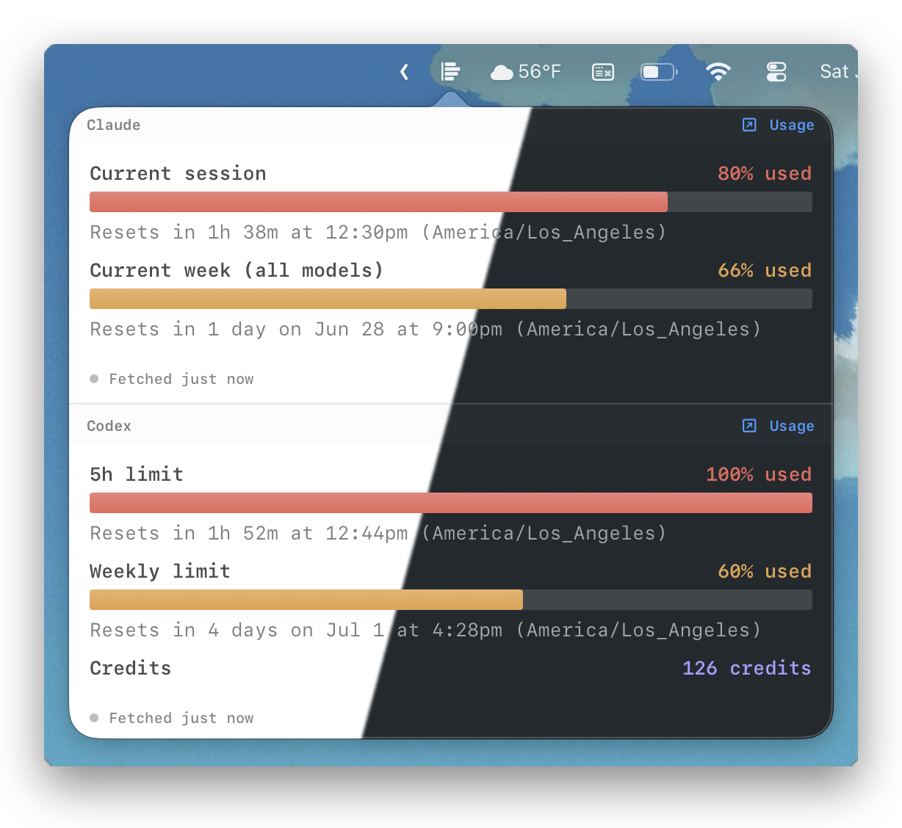

# CC Usage Bar

A minimal macOS menu bar app that shows your [Claude Code](https://claude.com/claude-code) and [OpenAI Codex](https://github.com/openai/codex) usage at a glance, stacked in one popover.



## Why

Claude Code doesn't expose a persistent usage indicator. The only way to check is to open a session and type `/usage`. When you're running multiple Claude Code sessions across different terminal windows, checking your usage means either interrupting a running agent mid-task or opening a new terminal just to see a number. Both are disruptive. Codex has the same problem — `/status` only lives inside a running session.

Many community tools solve this by reading the OAuth token from the macOS Keychain and calling Anthropic's usage API directly. But macOS will prompt you every time a third-party app tries to access that Keychain item — not a smooth experience, and handing your OAuth token to another process is a legitimate security concern.

The original project was vibe-coded using Claude Code itself. This fork extends it to also cover Codex and adds structured parsing, threshold notifications, and a per-provider abstraction so additional CLIs can be added without rewriting the driving logic.

CC Usage Bar takes a different approach. It doesn't touch your Keychain or make any network calls itself. It simply runs `claude` (and optionally `codex`) the same way you would, captures the `/usage` or `/status` output, and displays it in your menu bar — one click away, always accurate.

## How it works

When you click the menu bar icon, CC Usage Bar opens a popover containing an embedded terminal. Behind the scenes it:

1. Spawns a real CLI session in a pseudo-terminal (PTY) — `claude` for Claude Code, `codex` for Codex
2. Sends the provider's usage command automatically (`/usage` for Claude, `/status` for Codex)
3. Captures the output and renders it with full ANSI color fidelity — exactly as it appears in your terminal
4. Parses the captured output into structured metrics (percent used, reset times, credits) for the native UI, with the raw terminal output available as a fallback
5. Terminates the session immediately after (Claude's session is reused across refreshes; Codex spawns fresh each time)

There is no API scraping, no token parsing, no reverse engineering. The data comes straight from the CLIs themselves, so it is always 100% accurate and reflects the latest state.

For the full technical writeup — including the non-obvious Codex discovery (ratatui's char-by-char cursor positioning breaks string-based banner detection, so Codex is driven on timers instead) — see [`docs/CODEX_INTEGRATION_NOTES.md`](docs/CODEX_INTEGRATION_NOTES.md).

## Features

- 🪶 **Minimal** — a single menu bar icon, one popover, no windows
- 🤖 **Multi-provider** — Claude Code and Codex stacked in one view, each driven by its own CLI session
- 🎯 **Accurate** — reads directly from each CLI's own `/usage` or `/status` output
- 🔔 **Threshold alerts** — macOS notifications when usage crosses 60% / 80% / 100% per metric
- 🔒 **Safe** — no API calls, no credentials stored, no hacks; just runs the CLIs the same way you would
- ⚡ **Zero setup** — install, open, click the icon (requires the relevant CLI already configured on your machine)
- 🍎 **Native** — built in Swift with SwiftUI, runs as a lightweight menu bar agent

## Requirements

- macOS 14 Sonoma or later
- [Claude Code](https://docs.anthropic.com/en/docs/claude-code) installed and logged in (`claude` must be on your PATH)
- (Optional) [Codex](https://github.com/openai/codex) installed and logged in (`codex` must be on your PATH) — if absent, the Codex panel simply shows a setup hint

## Install

### Download (recommended)

1. Download the latest `CCUsageBar.zip` from the [Releases](../../releases) page
2. Unzip and move `CCUsageBar.app` to your `/Applications` folder

> **Note:** Since this app is not notarized, macOS Gatekeeper will block it on first launch.
> To open it, either:
> - Right-click the app → **Open** → **Open**
> - Or run in Terminal: `xattr -d com.apple.quarantine /Applications/CCUsageBar.app`

### Build from source

With Xcode:

1. Clone the repository
2. Open `CCUsageBar/CCUsageBar.xcodeproj` in Xcode
3. Build and run (Cmd+R)

Without Xcode (Command Line Tools only):

```bash
./build.sh        # build into ./build/CCUsageBar.app
./build.sh --run  # build, kill any running instance, and relaunch
```

The app runs as a menu bar agent — there is no Dock icon. Look for the chart icon in your menu bar.

## Usage

- **Left-click** the menu bar icon to open the usage popover
- **Click anywhere outside** the popover to dismiss it
- **Right-click** the menu bar icon to quit

Each time you open the popover, it fetches fresh usage data. A background refresh also runs every 5 minutes so cached values stay warm.

## License

MIT

---

⭐ If this tool helps you avoid hitting Claude or Codex limits, consider giving it a star!
